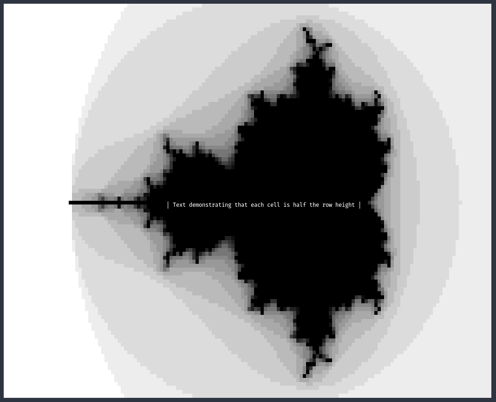

# HalfHeight

An extension to `UI.NCurses` for drawing half-height console graphics.

By drawing a Unicode [Upper Half Block](https://www.compart.com/en/unicode/U+2580) character (▀) with different foreground and background colors, one can simulate drawing two rows of a 2D grid of colors in one row, achieving grid cells that take up half a console row alongside regular console text.



There's a [brief writeup](https://askham.ai/2020/11/26/half-height-console-graphics.html) on my blog.

The main caveat is that one is now restricted to 15 unique colors: `UI.NCurses` usually lets you define 255 custom foreground/background combinations, but now we might have any two colors appear as our foreground/background.

## Usage Example

``` haskell
greyScale :: [String]
greyScale =
  [ "000000",
    "111111",
    -- ... 12 intermediate hex strings omitted ...
    "ffffff"
  ]

-- Calculate the Mandelbrot steps-to-divergence and plot as Color 1 to Color 15
mandelbrot :: (Fractional a, RealFloat a) => a -> a -> Color
mandelbrot x y = Color (16 - ((+) 1 $ steps (0 :+ 0) (x' :+ y') 0))
  where
    x' = (x - 100) * 0.025
    y' = (y - 50) * 0.025
    steps z c i
      | i > 13 || magnitude z' > 2 = i
      | otherwise = steps z' c (i + 1)
      where
        z' = z * z + c

-- Draw the Mandelbrot set to the buffer point by point
drawMandelbrot :: Buffer -> Buffer
drawMandelbrot buffer =
  foldl'
    (\b (x, y) -> setXY x y (mandelbrot (fromIntegral x) (fromIntegral y)) b)
    buffer
    [(x, y) | x <- [0 .. 149], y <- [0 .. 99]]

main :: IO ()
main = do
  -- Register the 15 greyscale hex colors as Color 1 through Color 15.
  -- Every combination of these colors (fg and bg) is registered with Curses
  -- with a unique ID, which we return in the colorMap.
  colorMap <- runCurses $ initHexColors greyScale

  -- Creates a new buffer and draws the Mandelbrot set in each cell using the
  -- greyscale colors 1 through 15
  let buffer = drawMandelbrot $ mkBuffer 150 100 (Color 1)

  runCurses $ do
    -- Hide the cursor
    setEcho False
    setCursorMode CursorInvisible

    -- Enter an infinite drawing loop displaying the buffer.
    forever $ do
      let drawOp = do
            -- First draw the buffer to the screen.
            drawBuffer colorMap 0 0 buffer
            -- Now draw some text in the centre.
            -- We set the color to curses ID corresponding to fg 15 (white) and bg 1 (black)
            setColor $ colorId colorMap (Color 15) (Color 1)
            moveCursor 25 50
            drawText "| Text demonstrating that each cell is half the row height |"
      w <- defaultWindow
      updateWindow w drawOp
      render
```

In this example we:

- Register `Color 1` through `Color 15` by providing a list of 15 hex strings to `initHexColors`. This sets the terminal colors appropriately, registers a unique curses `ColorID` for every possible foreground/background combination of each of the 15 colors, and returns a map from (fg, bg) tuples to corresponding `ColorID`.
- Create a `Buffer` (a 2D `Vector` of `Color`) by providing dimensions and a default color to `mkBuffer`.
- Draw on this buffer using `SetXY`.
- When ready to blit to the screen, `drawBuffer` will create the appropriate curses `Update ()` operations for writing the corresponding Upper Half Block characters to the terminal to render the buffer rows at half-height.
